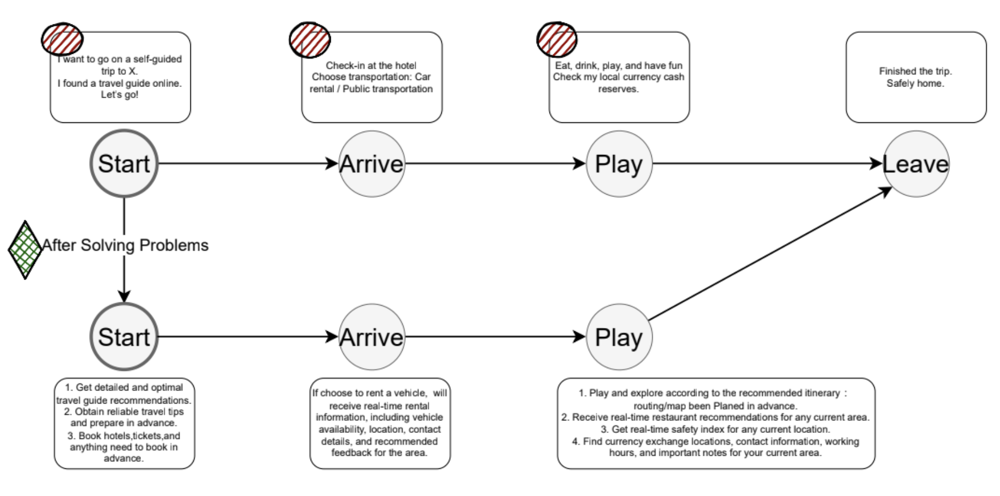
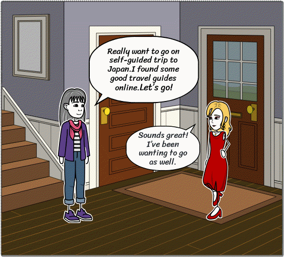

# ✈️ PlanGo

**PlanGo** is a UI/UX design course project that addresses common challenges travelers face.  
It visualizes user flows to identify pain points, incorporates storytelling to explain the design thinking process, and presents a polished interactive prototype built in Figma.

---

## 🌟 Features

- **User Flows**: Map out traveler scenarios to uncover friction points and design solutions.
- **User Storytelling**: Show the emotional and practical journey of a user through animation.
- **Figma Prototype**: Deliver a full interface design with interactions and responsive layout.

---

## 🖼️ Preview

### 🔄 User Flow

> This diagram shows how users navigate through the app and where pain points and solutions are identified.

<p align="center">
  
</p>

---

### 📖 Storytelling Animation

> Watch how the persona’s journey inspired design decisions and shaped the final experience.
> 
<p align="center">
  
</p>

---

### 🎬 Figma Prototype Demo

> Explore the interactive prototype that brings the design to life.

[▶ View Figma Prototype](https://www.figma.com/proto/zBx3VqjyuJguNWb3oT8TA1/PlanGo-Travelling-App?node-id=2078-3038&p=f&t=7Etaxm74a8onbIjB-1&scaling=scale-down&content-scaling=fixed&page-id=1%3A2&starting-point-node-id=2078%3A3038)


---

## 🚀 Installation

1. Clone the repository:
   ```bash
   git clone https://github.com/Muyun2023/PlanGo.git
